# GTO ♠️

> Deep CFR solver for Heads-Up No-Limit Texas Hold'em subgames — learn Nash Equilibrium strategies from scratch via self-play.

## Architecture

```mermaid
flowchart TB
    subgraph ENV["🃏 Vectorized HUNL Environment"]
        direction LR
        DEAL["Deal Flop\n+ Hole Cards"]
        SIM["1024 Parallel\nGames (CUDA)"]
        SD["7-Card Showdown\nLUT Evaluator"]
        DEAL --> SIM --> SD
    end

    subgraph ENCODE["📐 State Encoder — 199 Features"]
        direction LR
        CARDS["Card Encoding\n52 hole + 52 board\n+ 52 opp range\n= 156 features"]
        BET["Betting State\npot · stacks · call\n+ street one-hot\n= 8 features"]
        HIST["Action History\nlast 5 actions × 7\n= 35 features"]
    end

    subgraph NETS["🧠 Neural Networks (PyTorch)"]
        direction LR
        ADV["Advantage Net\n199→512→512→512→512→5\nLeakyReLU · MSE Loss"]
        POL["Policy Net\n199→512→512→512→512→5\nLeakyReLU · KL Loss"]
    end

    subgraph CFR["♻️ MCCFR Training Loop"]
        direction TB
        RM["Regret Matching+\nCompute Action Policy"]
        SAMPLE["Outcome Sampling\nTraverse Game Tree"]
        REGRET["Counterfactual\nRegret Backup"]
        RM --> SAMPLE --> REGRET
    end

    subgraph BUFFERS["💾 Reservoir Buffers (1M each)"]
        direction LR
        ABUF["Advantage Buffer\n(state, regrets)"]
        SBUF["Strategy Buffer\n(state, policy)"]
    end

    subgraph EVAL["📊 Evaluation & Infra"]
        direction LR
        LBR["LBR Exploitability\nBest-Response Metric"]
        CKPT["Checkpointing\nPeriodic + SIGUSR1"]
        TB["TensorBoard\nLoss · LBR Curves"]
    end

    ENV -->|"game states"| ENCODE
    ENCODE -->|"199-d tensor"| NETS
    ADV -->|"advantages"| CFR
    CFR -->|"regrets"| ABUF
    CFR -->|"action probs"| SBUF
    ABUF -->|"batch 4096"| ADV
    SBUF -->|"batch 4096"| POL
    POL -.->|"evaluate"| LBR
    NETS -.->|"weights"| CKPT
    NETS -.->|"loss scalars"| TB

    style ENV fill:#1a1a2e,stroke:#e94560,color:#eee
    style ENCODE fill:#16213e,stroke:#0f3460,color:#eee
    style NETS fill:#0f3460,stroke:#533483,color:#eee
    style CFR fill:#533483,stroke:#e94560,color:#eee
    style BUFFERS fill:#1a1a2e,stroke:#0f3460,color:#eee
    style EVAL fill:#16213e,stroke:#533483,color:#eee
```



## Key Specs

| Component | Detail |
|---|---|
| **State Vector** | `199` features (156 cards + 8 betting + 35 history) |
| **Action Space** | Fold · Check/Call · Bet 33% · Bet 75% · All-In |
| **Networks** | 4-hidden-layer MLPs, 512 units, LeakyReLU |
| **Losses** | MSE (advantage regrets) · KL divergence (policy targets) |
| **Traversal** | Outcome-sampling MCCFR with Regret Matching+ |
| **Replay** | 1M-capacity reservoir sampling buffers |
| **Showdown** | Exact 7-card batched evaluator via C(52,5) LUT |
| **Evaluation** | Local Best Response exploitability estimate |
| **Precision** | bf16 mixed-precision on A100 (CUDA) |
| **Infra** | SIGUSR1-aware checkpointing · TensorBoard logging · SLURM-ready |

## Install
```bash
pip install -e .
pip install -e .[dev]
```

## Run Tests
```bash
pytest
```

## Training
```bash
python -m gto.train.trainer \
  --subgame_board Kh8s2c \
  --learning_rate 3e-4 \
  --batch_size 4096 \
  --iterations 200 \
  --checkpoint_dir checkpoints \
  --resume_from checkpoints/latest.pt
```

## Notes
- This repository currently provides a training scaffold and interfaces.
- LUT build can take time on first initialization, then reuses cached tensors per process/device.
- Checkpoints include model weights, optimizer states, and both reservoir buffers.
